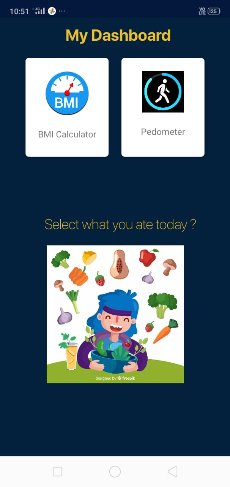
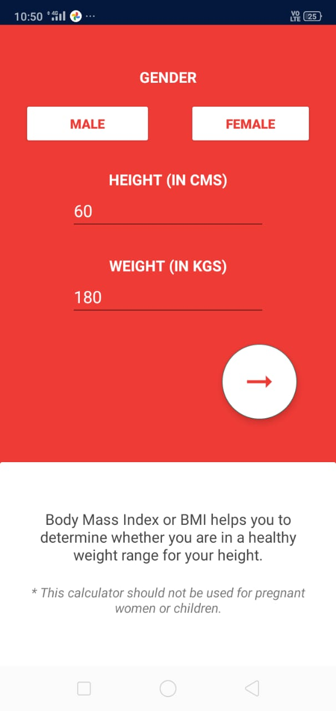
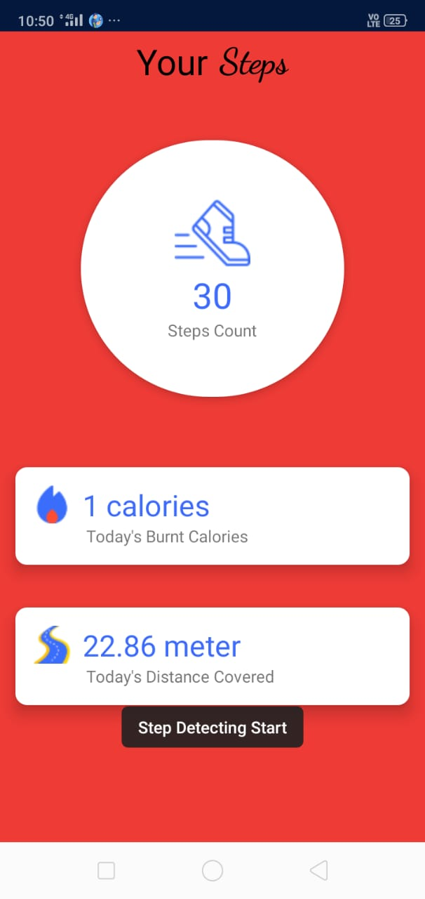
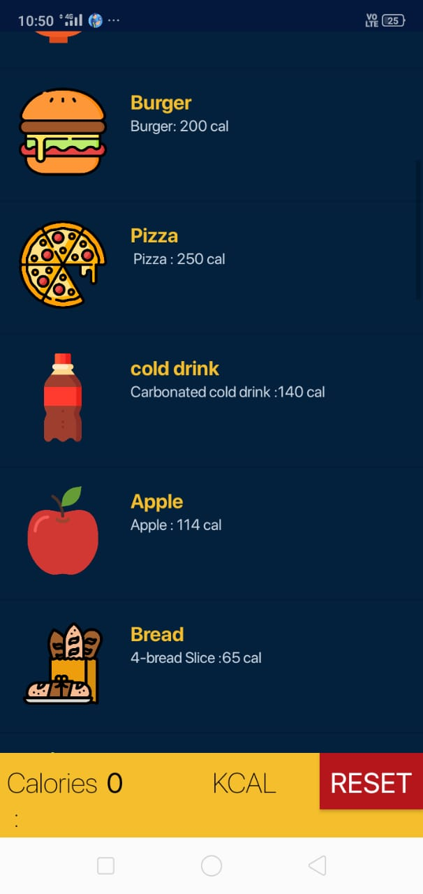

# HMS
  This a health monitoring app used to monitor diet, steps and Bmi by measuring the amount of calories consumed and amount lost from walking or running.

# Technology/language/tools Used 
 - firebase 
 - kotlin
 - java
 - android studio

# Screenshots

